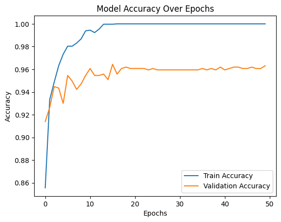
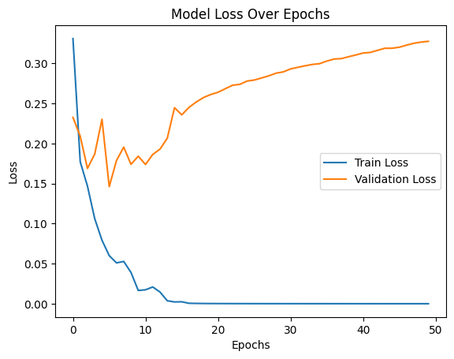
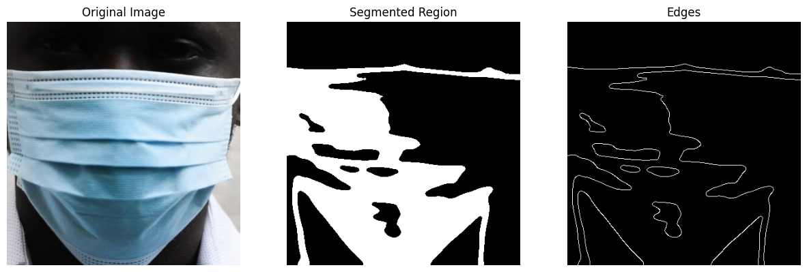
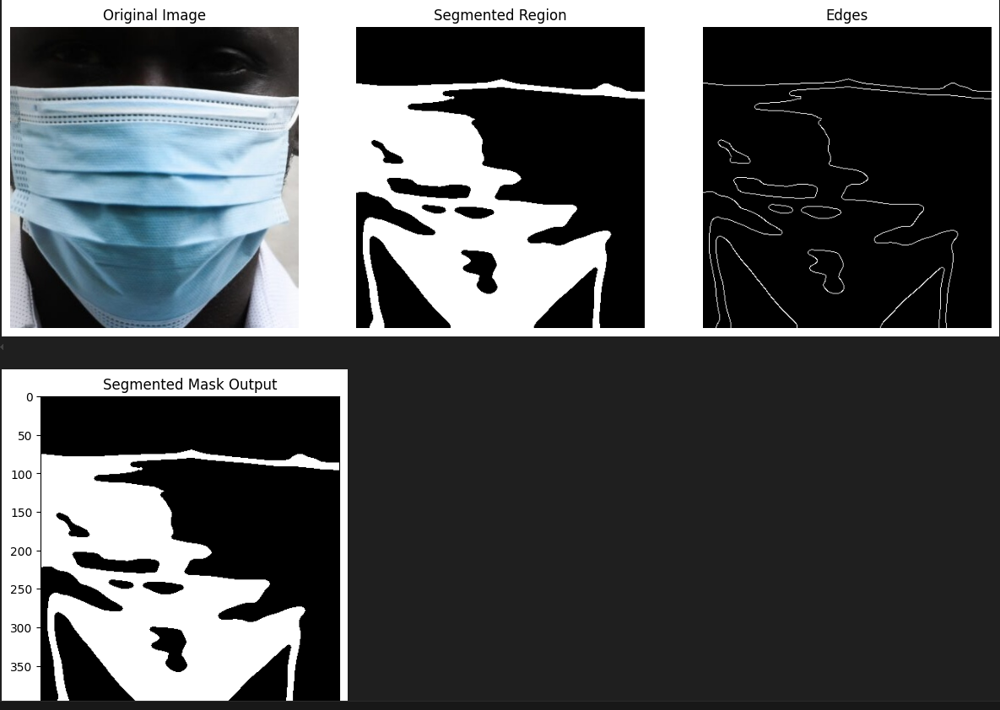
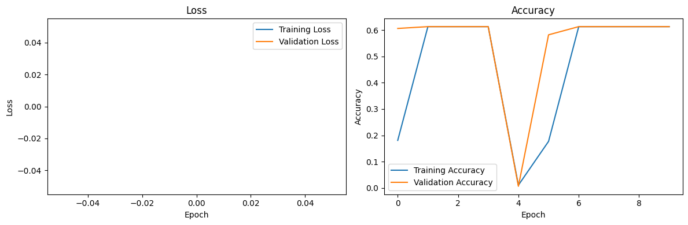
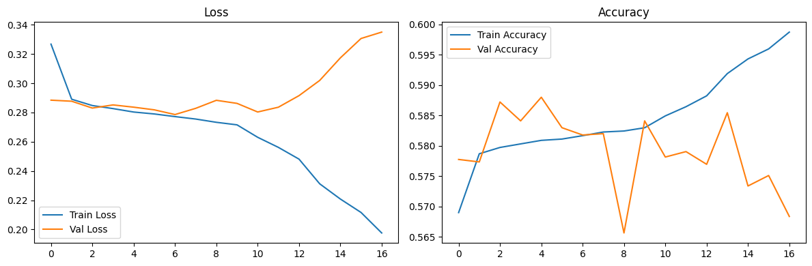
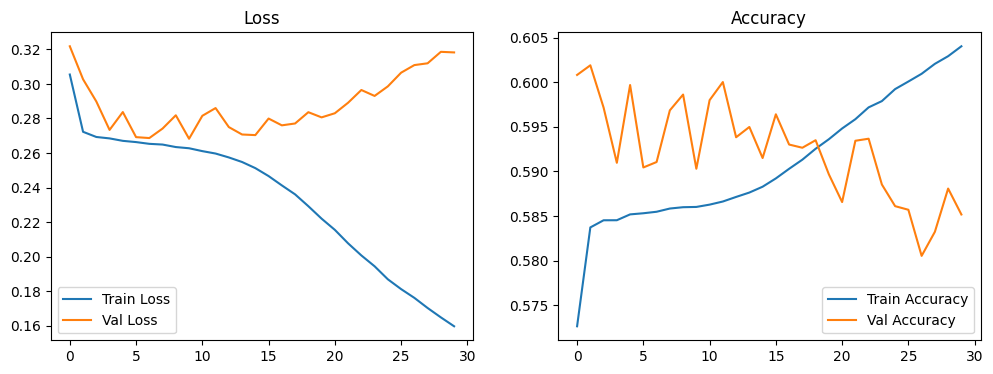
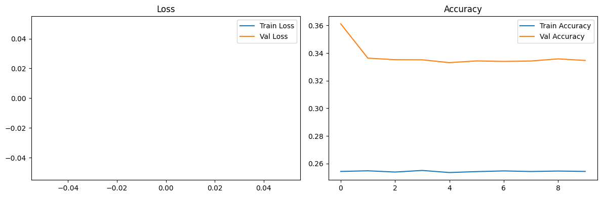

# FaceMask Detection and Segmentation 

## 1. Introduction
This project focuses on identifying and segmenting face masks in images using a combination of deep learning and machine learning techniques. It involves region-based segmentation with traditional image processing methods, mask segmentation using U-Net, and binary classification using both CNN models and handcrafted features with conventional classifiers. The aim is to compare the accuracy and effectiveness of these different approaches for mask detection and segmentation.

### Contributers:

(IMT2022071) Samyak Jain <Samyak.jain@iiitb.ac.in>


(IMT2022118) Shashwat Chaturvedi <Shashwat.chaturvedi@iiitb.ac.in>


(IMT2022520) Nupur Patil <Nupur.patil@iiitb.ac.in>  


---

## 2. Dataset

### Source:

The datasets used in this project come from the following sources:  


- [Face Mask Detection Dataset](https://github.com/chandrikadeb7/Face-Mask-Detection/tree/master/dataset)  

- [MFSD Dataset](https://github.com/sadjadrz/MFSD)  


```
dataset
├── with_mask # contains images with mask
└── without_mask # contains images without face-mask
```
```
MSFD
├── 1
│   ├── face_crop # face-cropped images of images in MSFD/1/img
│   ├── face_crop_segmentation # ground truth of segmend face-mask
│   └── img
└── 2
    └── img
```

### Dataset Structure:
- **Training Set:** Images used for training the models.
- **Testing Set:** Images used to evaluate model performance.
- **Annotations:** Mask region labels for segmentation tasks.

---


## 3. Objectives and Evaluation  

### a. Binary Classification with Handcrafted Features and ML Models (4 Marks)  
1. Extract important handcrafted features from facial images.  
2. Train and test at least two machine learning models, such as SVM and Neural Networks, to classify images as "with mask" or "without mask."  
3. Evaluate and compare the accuracy of these models to determine the best-performing classifier.  

### b. Binary Classification with CNN (3 Marks)  
1. Design and train a Convolutional Neural Network (CNN) for mask classification.  
2. Experiment with different hyperparameters, including learning rate, batch size, optimizer, and activation functions, and report the findings.  
3. Compare the CNN’s performance with the traditional machine learning classifiers.  

### c. Region-Based Segmentation Using Traditional Methods (3 Marks)  
1. Apply classical segmentation techniques, such as thresholding and edge detection, to identify and segment mask regions in images classified as "with mask."  
2. Visualize the segmented regions and assess their accuracy.  

### d. Mask Segmentation with U-Net (5 Marks)  
1. Train a U-Net model to accurately segment face masks from images.  
2. Compare its segmentation performance with traditional methods using metrics like Intersection over Union (IoU) and Dice Score.  


---


## 4. Results  

### Evaluation Metrics  
- **For Classification:** Accuracy, Precision, Recall, and F1-score  
- **For Segmentation:** Intersection over Union (IoU) and Dice Score  

| Model | Accuracy (%) | IoU | Dice Score |  
|-------------------------|--------------|------|------------|  
| SVM (Binary Classification) | 88.04780876494024% (80-20 split) | - | - |  
| MLP (Binary Classification) | 92.56308100929614% (80-20 split) | - | - |  
| CNN | 96.31% | - | - |  
| Region-Growing (Segmentation) | - | 0.3997 (Avg) | 0.5365 (Avg) |  
| Otsu's Thresholding (Segmentation) | Provided below(5) | - | - |  
| U-Net (Mask Segmentation) | - | 0.7856(Final) | 0.8799(Final) |  


---


## 5. Observations & Analysis

### Part_a: Binary Classification Using Handcrafted Features and ML Classifiers

##### Support Vector Machine (SVM)
- The SVM model performed **fairly well**, achieving an accuracy of **88.05%**.
- It correctly identified both positive and negative cases without being biased toward one. This means it didn’t miss too many positives (high recall) or falsely label negatives as positives (high precision).
- The **f1-score of 0.88** suggests that the model makes reliable predictions but still has some room for improvement.
- A few misclassifications could be due to **lighting variations, obstructions, or feature extraction limitations**.
- Overall, SVM does a solid job, but it might not be the best option for complex patterns.

##### Multi-Layer Perceptron (MLP)
- The MLP model performed **better than SVM**, with an accuracy of **92.56%**.
- Its **f1-score of 0.93** shows that it captures patterns more effectively.
- Compared to SVM, MLP made fewer mistakes by missing masked or unmasked faces, meaning it identified them more accurately.
- The improvement is likely because MLP, being a neural network, can learn more **complex relationships** in the data.
- With some fine-tuning (like adjusting hidden layers or activation functions), it could perform even better.

##### Key Takeaways:
- HOG (Histogram of Oriented Gradients) helps detect objects by focusing on edges and shapes in an image. It works by analyzing how light and dark areas change, making it great for tasks like face and pedestrian detection.
-LBP (Local Binary Patterns) recognizes textures by comparing how bright or dark a pixel is compared to its neighbors. It turns these comparisons into simple patterns, making it useful for facial recognition and texture analysis
- **Thus used these 2 methods and were proven to be effective**
- For further improvements, switching to a **CNN-based feature extraction approach** might be the next step.


### Part_b: Using CNN

#####  CNN   
With CNN, we saw a **huge improvement**, achieving **96.3% accuracy**, making it clear that deep learning is far more effective for this task.

#####  Accuracy Trends
- The model **quickly hit 100% training accuracy**, but validation accuracy leveled off at **~96%**.  
- This suggests **overfitting**—the model memorized the training data well but didn’t generalize perfectly to new images.  
- Still, **96% validation accuracy** is a solid performance!

#####  Test Performance  
- **Final test accuracy:** **96.3%**—way better than traditional methods.  
- **Breakdown of results:**  
  - "With Mask" → **97% Precision, 96% Recall**  
  - "Without Mask" → **96% Precision, 96% Recall**  
- This means the model is **equally good** at classifying both categories, with no major bias.

#### Hyperparameters and Experiments

The following hyperparameters and experimental settings were used in the code:

1. **Image Resizing**: The images are resized to 64x64 pixels to match the input size required by the Convolutional Neural Network (CNN).
   ```python
   img = cv2.resize(img, (64, 64))  # Resize to match CNN input

2. **Normalization**: The pixel values of the images are normalized to the range [0, 1] by dividing by 255.0
   ```python
   X = np.array(X, dtype=np.float32) / 255.0  # Normalize pixel values

4. **Train-Test Split**: The dataset is split into training and testing sets with a test size of 20% and a random state of 42 for reproducibility.
   ```python
   train_X, test_X, train_Y, test_Y = train_test_split(X, y, test_size=0.2, random_state=42)

| **Code**       | **Hyperparameters Used**                                                                 | **Experiments Done**                                      |
|-----------------|------------------------------------------------------------------------------------------|-----------------------------------------------------------|
| **Part B Code** | - Image Size: 64x64<br>- Test Split: 20%<br>- Layers: 2 Conv2D (32, 64 filters), 2 Dense (128, 1)<br>- Optimizer: Adam<br>- Loss: Binary cross-entropy<br>- Epochs: 50<br>- Batch Size: 32<br>- Threshold: 0.5 | - Loaded and preprocessed face mask images<br>- Defined and trained a CNN for binary classification<br>- Visualized accuracy/loss over epochs<br>- Evaluated with classification report |


#### Keytakeaways:

- Model Accuracy Over Epochs: The training accuracy quickly reaches 100%, indicating potential overfitting, while validation accuracy stabilizes around 96%, suggesting a well-performing model but possible generalization issues.
  

<p align="center">
  
</p>


- Model Loss Over Epochs: Training loss decreases to near zero, while validation loss increases, indicating overfitting, where the model memorizes training data but struggles with unseen data.
  
<p align="center">
  
</p>


### Part_c: Segmentation using traditionals
##### **1. Segmentation Performance**
| Method                | IoU Score | Dice Score |
|-----------------------|----------|------------|
| **Region Growing**    | 0.3997   | 0.5365     |
| **Otsu’s Thresholding** | 0.3156   | 0.4430     |

- Dice Score emphasizes similarity and is computed as (2 × Intersection) / (Total Area of Both Sets).
- IoU (Intersection over Union) is computed as Intersection / Union, making it more sensitive to small overlaps.
- We have calculated both of them to accurately measures the performance of our methods
- Before applying the techniques over the entire dataset of thousands of images, we first experimented with some individual images as u can see in the result below
- The image taken below is from the dataset the code for processing is given below:
   ```python
   # Perform segmentation using region growing method
    segmented_output = segment_region_growing(
    image_path='../dataset_my/MSFD/1/face_crop/000000_1.jpg',
    viz=True,
    tolerance=0.19
    )

    # Define the corresponding ground truth mask path
    ground_truth_path = '../dataset_my/MSFD/1/face_crop_segmentation/000000_1.jpg'

    # Compute and display segmentation evaluation metrics
      evaluation_results = compute_metrics(segmented_output, ground_truth_path)
      print(evaluation_results)



  


##### **Region Growing Method**
- Achieved **higher accuracy**, with an IoU of **0.3997** and a Dice score of **0.5365**.
- Adaptive to local intensity variations but **sensitive to tolerance selection**.
- Works well on images with smooth transitions but may leak into adjacent regions.


##### **Otsu’s Thresholding**
- Lower IoU of **0.3156** and Dice score of **0.4430**.
- Global thresholding leads to **over-segmentation or under-segmentation** in non-uniform lighting conditions.
- Computationally efficient but **not adaptive** to local intensity variations.


#### **2. Key Takeaways**
- Here we applied two techniques and then compared the outputs in them.
- **Region Growing is more accurate** but requires fine-tuning of tolerance.
- **Otsu’s method is faster**, but struggles in varying lighting conditions.


#### **3. Conclusion**
Region Growing currently performs better for this dataset, but further tuning and hybrid approaches could yield even better results.


### Part_d: Using UNet method to get better output.

Here we have done four implementations of U-Net models for segmenting face crops from images in the MSFD dataset. Below we have done performance analysis

#### Dataset
- **Source**: Images (`.\MSFD\MSFD\1\face_crop`) and masks (`.\MSFD\MSFD\1\face_crop_segmentation`). (Adjust the path according to ur directories)
- **Preprocessing**: Resized to 128x128, normalized to [0, 1], split into 80% training and 20% validation.


#### Approch 1: Baseline U-Net
- **Architecture**: 3 encoder levels (64, 128, 256), 512-filter bridge, 3 decoder levels, mixed precision training.
- **Training**: 20 epochs, batch size 8, binary cross-entropy loss, `EarlyStopping`, `ModelCheckpoint`.
- **Metrics**:
  - Dice Score: 0.0126
  - IoU Score: 0.006
- **Observations**: We could see poor segmentation (near-zero Dice/IoU). We think that the accuracy which we got is likely due to the background dominance.
- **Issues**: Insufficient training or data mismatch likely caused failure to segment faces. We even saw that the code was auto killed due to stagnant growth curve
- 



#### Approch 2: Enhanced U-Net with BatchNormalization and LeakyReLU
- **Architecture**: 3 encoder levels (64, 128, 256), 512-filter bridge, `BatchNormalization`, `LeakyReLU`.
- **Training**: 30 epochs, batch size 8, binary cross-entropy, `EarlyStopping`, `ReduceLROnPlateau`, `ModelCheckpoint`.
- **Metrics**:
  - Dice Score: 0.8799
  - IoU Score: 0.7856
- **Observations**: This approch gave the best segmentation, slightly lower accuracy reflects better foreground focus.
- **Strengths**: `BatchNormalization` and adaptive learning rate improved performance significantly.


#### Approch 3: Deeper U-Net with Conv2DTranspose
- **Architecture**: 4 encoder levels (64, 128, 256, 512), 1024-filter bridge, `Conv2DTranspose` with cropping.
- **Training**: 30 epochs, batch size 8, binary cross-entropy, no callbacks.
- **Metrics**:
  - Dice Score: 0.8686
  - IoU Score: 0.7677
- **Observations**: Segmentation achieved was pretty close to approch 2, deeper model adds complexity but lacks training optimization. Slowest inference (12s).
- **Issues**: If we don’t use EarlyStopping, the model might overfit. Without mixed precision it increases computation cost.


#### Approch 4: U-Net with Dice Loss
- **Architecture**: 3 encoder levels (64, 128, 256), 512-filter bridge, `Conv2DTranspose`, mixed precision.
- **Training**: 20 epochs, batch size 16, custom `dice_loss`, `EarlyStopping`, `ReduceLROnPlateau`, `ModelCheckpoint`.
- **Metrics**:
  - Dice Score: 0.4360
  - IoU Score: 0.2787
- **Observations**: We observed moderate segmentation, lowest accuracy due to Dice loss focus.
- **Issues**: Dice loss didn’t yield high Dice/IoU, possibly due to short training or large batch size.


#### Comparative Analysis
| Code | Dice Score | IoU Score | Key Features |
|------|------------|-----------|--------------|
| 1    | 0.0126     | 0.006     | Baseline, mixed precision |
| 2    | 0.8799     | 0.7856    | BatchNorm, LeakyReLU, scheduler |
| 3    | 0.8686     | 0.7677    | Deeper, Conv2DTranspose |
| 4    | 0.4360     | 0.2787    | Dice loss, mixed precision |


- **Best Segmentation**: Approch 2 (Dice 0.8799, IoU 0.7856) excels, balancing architecture and training enhancements.
- **Fastest**: Approch 1 and 4  leverage mixed precision.
- **Worst Performer**: Approch 1 fails at segmentation; Approch 4 underperforms despite Dice loss.


#### Conclusion
We observed approaches 2 and 3 do a good job at segmenting faces, but Approach 2 is a bit better because of improved training. Approach 1 shows what happens without these improvements, and Approach 4’s Dice loss experiment needs more fine-tuning.


## 6. How to Run the Code

### Setup

1. First, clone this repository and navigate into the project directory:
   ```bash
   git clone https://github.com/JConquers/VR_Project_1
   cd VR_PROJECT_1

   ```
2. Set up a virtual environment and install the required dependencies:
    
   ```bash
    python -m venv env
    source env/bin/activate
    pip install -r requirements.txt

   
3. Download the dataset as specified and ensure the dataset and MSFD directories are placed at the same level as the repository. Additionally, create a directory named output using the command mkdir output. Your final folder structure should resemble this: ```
    ```
    .
    ├── dataset
    ├── MSFD
    ├── output
    ├── scripts
    └── images
    ```
    #### Other files like README.md, pdf, etc are not shown in this tree.

5. Execute the scripts:

   ##### Inside the scripts directory, you’ll find two Jupyter notebooks: part_a_b.ipynb and part_c_d.ipynb. These scripts can be executed together or separately to observe partial results.
    ---


